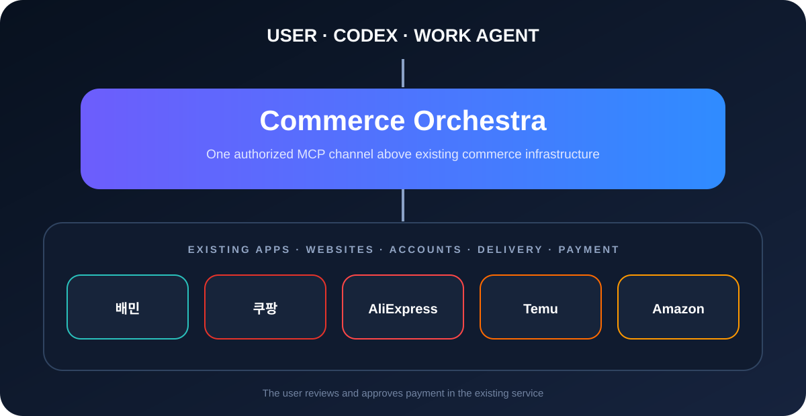

# Commerce Orchestra for Codex

Commerce Orchestra lets Codex prepare shopping and food-delivery requests through services people already use. It sits above existing web and app infrastructure; it does not replace the storefront, account, delivery, or payment system.



```text
User request
    ↓
Codex + Commerce Orchestra plugin
    ↓  authorized MCP channel
Private Commerce Orchestra runtime
    ↓
Baemin · Coupang · AliExpress · Temu · Amazon · future connectors
    ↓
Verified cart → user reviews and approves payment
```

## What this repository contains

- The installable Codex plugin manifest and interaction skill
- Public integration boundaries for a provisioned MCP runtime
- The subscription entitlement API contract
- Privacy, terms, and intellectual-property notices

The decision engine, Meta Layer implementation, platform adapters, automation logic, credentials, and patent-related implementation are not included. A working purchase connection requires a separately provisioned Commerce Orchestra MCP runtime.

## Current pilot

| Integration | Pilot state |
|---|---|
| Codex | MCP communication verified |
| Coupang | Existing web checkout flow tested through user handoff |
| Baemin | Existing Android app connection tested |
| AliExpress · Temu · Amazon | Connector slots reserved |
| Payment | User approval required |

Commerce Orchestra is not affiliated with or endorsed by the listed commerce services. Their names and trademarks belong to their respective owners.

## Distribution model

The plugin may be visible and installable, while access to the private MCP runtime is controlled by an external Commerce Orchestra account. The runtime returns only entitlement state, remaining allowance, and renewal timing; it does not expose billing credentials to Codex.

## Repository layout

```text
.agents/plugins/marketplace.json        Codex marketplace catalog
plugins/commerce-orchestra/             Installable plugin package
contracts/entitlement-api.yaml          Public subscription boundary
docs/platform-layer.svg                 Public architecture overview
```

See [Privacy](PRIVACY.md), [Terms](TERMS.md), and [Intellectual Property Notice](NOTICE.md).
